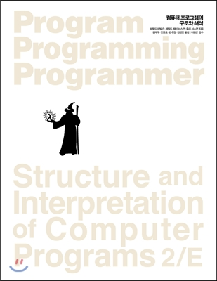

# SICP 문제 풀이
마법사책 스터디 그룹 과제

## 스터디 가이드
매주 토요일 16시(KST)에 스터디가 있습니다.

- 지정된 분량을 읽고 문제를 풀어옵니다.
- 각자 깃허브 리포지토리에 풀이를 올립니다.
- 스터디 당일 문제-참여자 랜덤 매칭하여 해설합니다.
- Google Meet을 이용해 매 주 원격 스터디 모임을 합니다.

### 스터디 교재
**SICP(Structure and Interpretation of Computer Program) 2/E**

- 번역서(정가 43,000원)

  
  
  *컴퓨터 프로그램의 구조와 해석, 김재우 외 옮김*
- 원서([html 버전](https://mitpress.mit.edu/sites/default/files/sicp/index.html))

  
  
  *원서의 html 버전은 공개 되어있음.*

### 스터디 참고 자료
- [Racket 설치 및 SICP 모듈 설정](https://kkalkkalparrot.tistory.com/32)
- [옮긴이의 글(긴 버전)](http://pchero21.com/?p=361)
- [커뮤니티 솔루션](http://community.schemewiki.org/?SICP-Solutions) : 해답지는 원래 없습니다.

### 스터디 목표
이 목표는 단지 그 주에 함께  살펴볼 진도일 뿐입니다. 개인의 역량이나 시간에 따라 더 진도를 나가도 좋습니다!
- [x] 9월 2주차: 서문 + 1.1절(@일요일 16시)
- [ ] 9월 3주차: 1.2절
- [ ] 9월 4주차: 1.3절

## 스터디 참가자 일람
- [@murry2018](https://github.com/murry2018/wizardbook)
- [@nicksuh](https://github.com/nicksuh/SICP_exercises/)
- [@KeisLuv5991](https://github.com/KeisLuv5991/SicpExercise)
- [@fienestar](https://github.com/fienestar/sicp)
- [@dsyun96](https://github.com/dsyun96/wizard-practice)
- [@blurfx](https://github.com/blurfx/sicp)
- [@rosqxkedrt](https://github.com/rosqxkedrt/sicp_study)
