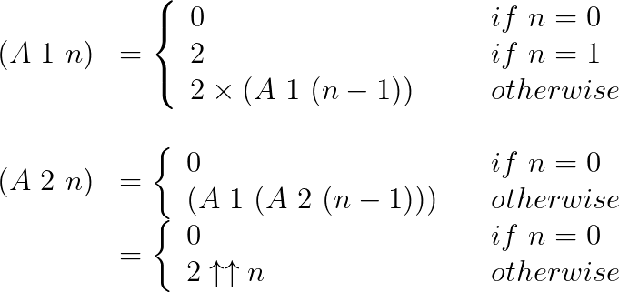
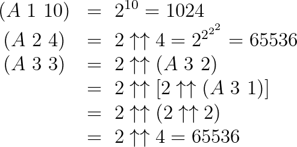
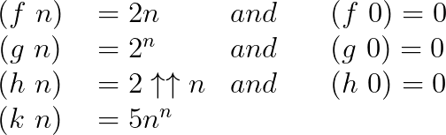
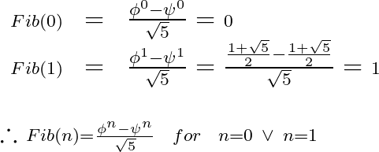
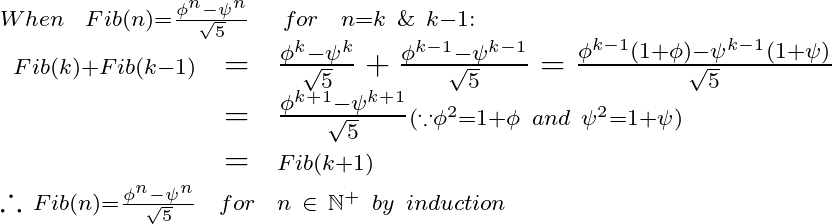
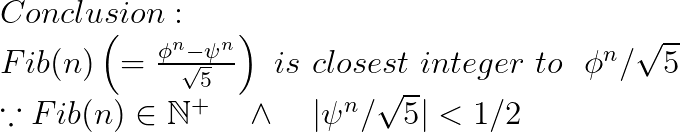

### 연습 1.9 (p. 46)
되도는 프로세스를 만들어낸다.

```scheme
(+ 4 5)
(inc (+ 3 5))
(inc (inc (+ 2 5)))
...
(inc (inc (inc (inc (+ 0 5)))))
(inc (inc (inc (inc 5))))
...
(inc 8)
9
```

### 연습 1.10 (p. 47)
**우선 `(A 1 n)`과 `(A 2 n)`가 어떤 함수인지부터 알아낸다.**
  


 **이를 이용해 `(A 1 10)`, `(A 2 4)`, `(A 3 3)`의 값을 계산한다.**
  


**`(f n)`, `(g n)`, `(h n)`, `(k n)`은 각각 다음과 같이 정의할 수 있다.**
  


### 연습 1.11 (p. 54)
되도는 프로세스를 만드는 함수
```scheme
(define (f n)
  (if (< n 3) n
      (+ (f (- n 1))
         (f (- n 2))
         (f (- n 3)))))
```

반복하는 프로세스를 만들어내는 함수
```scheme
(define (f n)
  (define (iter f-1 f-2 f-3 count)
    (if (= count n) (+ f-1 f-2 f-3)
        (iter (+ f-1 f-2 f-3) f-1 f-2 (+ count 1))))
  (if (< n 3) n
      (iter 2 1 0 3)))
```

### 연습 1.12 (p. 54)
```scheme
(define (c n r)
  (if (or (= n 1) (= n r)) 1
      (+ (c (- n 1) (- r 1))
         (c (- n 1) r))))
```

### 연습 1.13 (p. 54)






