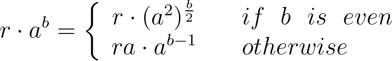
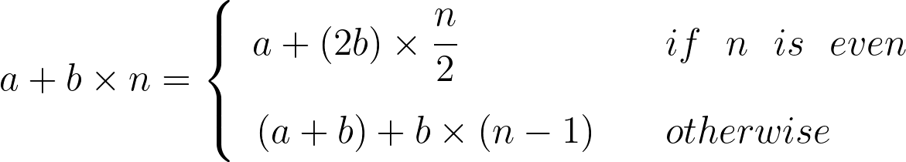

### 연습 1.15 (p.56)

**(a)** 

`(sine 12.15)`가 계산되는 과정을 맞바꿈 계산법으로 직접 수행해보면, `p`를 5번 호출하는 것을 확인할 수 있다.

```
sine 12.15
-> p (sine 4.5)
-> p (p (sine 1.5))
-> p (p (p (sine 0.5)))
-> p (p (p (p (sine 1/6))))
-> p (p (p (p (p (sine 1/18)))))
-> p (p (p (p (p 1/18))))
```

**(b)**

- 계산 단계의 자람 차수는 밑이 3인 입력값 a의 로그(O(log a))이다. 왜냐하면 a를 3으로 계속 나누어 0.1보다 작아질 때까지 계산하기 때문이다.
- 기억 공간의 자람 차수는 한 번 재귀 호출을 할 때마다 `p`가 똑같이 중첩되기 때문에 계산 단계와 같은 O(log a)의 자람 차수를 가진다.

### 연습 1.16 (p. 59)



```scheme
(define (iter r a b)
  (cond ((= b 0) 1)
        ((even? b) (iter r (square a) (/  b 2)))
        (otherwise (iter (* r a) a (- b 1)))))
(define (fast-expt x n)
  (iter 1 x n))
```

### 연습 1.17 (p.60)

```scheme
(define (* a b)
  (cond ((= b 0) 0)
        ((even? b) (* (double a) (halve b)))
        (otherwise (+ a (* a (- b 1))))))
```

### 연습 1.18 (p.61)



```scheme
(define (iter a b n)
  (cond ((= n 0) a)
        ((even? n) (iter a (double b) (halve n)))
        (otherwise (iter (+ a b) b (- n 1)))))
(define (* x y)
  (iter 0 x y))
```
