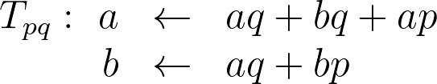

## 연습 1.19 (p.61)

### T 변환 구하기
우선 문제에서 제시한 대로 T 변환을 만들어 보면 다음과 같다.

p = 0, q = 1로 고정하여 T 규칙을 설정해놓고, 그 규칙에 따라 a = 1, b = 0부터 시작하여 차례로 계산하면 다음 피보나치 수가 계산됨을 확인할 수 있다.

이것을 관찰하면, `T(Fib(n), Fib(n-1))`를 하면 `(Fib(n+1), Fib(n))`를 구할 수 있고, `T(T(Fib(n), Fib(n-1)))`를 하면 `(Fib(n+2), Fib(n+1))`를 구할 수 있다는 걸 알 수 있다. 다시 말해 T를 n차례 거듭 계산하면 `Fib(m), Fib(m-1)`의 쌍을 단번에 `Fib(m+n), Fib(m+n-1)`로 계산할 수 있다는 것이다. 만일 T를 여러번 미리 계산할 수 있다면 그만큼 빠르게 피보나치 수열의 계산 과정을 건너뛸 수 있게 된다. 문제에서 원하는 것은 그렇게 T를 거듭 계산하는 방법을 알아내 보라는 것이다. 다행히도 문제에서 거듭 계산할 때 중요한 부분(p와 q의 위치)을 모두 알려주었고, 우리는 단지 거듭 계산했을 때 다음 p와 q가 어떻게 계산되는지만 살피면 된다.

이 계산에 따르면 코드의 빈 부분은 다음과 같다.

1. `(+ (square p) (square q)) ;; p' 값`
2. `(+ (* 2 p q) (squar eq)) ;; q' 값`

### T 변환에 대해서

이 방법이 타당한지를 증명하는 것까지 문제에서 원하는 것은 아니지만, 타당성을 밝히는 것은 그리 어렵지 않다. 타당성을 증명하기 위해 p와 q를 모두 펼치고 수학적 귀납법을 이용할 수도 있지만, 여기서는 행렬의 성질과 직관을 이용해 아이디어가 어떻게 전개되었는지만 보이도록 한다(**주의.** 이 내용을 이해하기 위해서는 기초적인 선형대수학 지식이 필요하다).

최초의 T 변환(p=0, q=1인 T 변환)은 식 (a)에서 보는 것 처럼 선형 변환으로 볼 수 있다.

그러므로 행렬변환의 성질에 따라 T 변환을 거듭 적용하는 것은 T의 변환 행렬 [T]를 거듭 제곱하는 것과 같다.

이러한 성질에 따르면 `(Fib(n), Fib(n-1))`를 `(1, 0)`의 쌍에 T 변환을 n번 거듭 적용한 것으로 볼 수 있다. 따라서 피보나치 수열을 빠르게 구하는 문제가 변환행렬 [T]의 거듭 제곱을 빠르게 구하는 문제로 바뀌게 된다. 행렬의 곱셈 또한 실수의 곱셈과 마찬가지로 지수법칙이 성립하기 때문에, `fast-expt`를 만들었던 예제나 연습문제 1.17과 마찬가지로 로그 단계로 자라나게끔 알고리즘을 만들 수 있다.

피보나치 수열을 찾는 일이 [T]의 행렬변환을 거듭 계산한 것으로 표현할 수 있기 때문에, [T]를 거듭제곱한 행렬의 원소를 p, q, r, s로 놓고 문제를 풀더라도 실은 무방하다. 그러나 이것을 p와 q에 대한 계산으로 줄일 수 있던 것은 이 [T]의 재밌는 성질 덕분이다. 그건 바로 [T]를 계속해서 곱하면 그 자신이 피보나치 수열을 포함하게 된다는 것이다. 이것은 다음과 같이 직관적으로 알아낼 수 있다.

사실 [T]를 거듭제곱한 행렬을 피보나치Q 매트릭스라고 부르는데, 이 행렬은 피보나치 수로만 이루어졌다는 것이 알려져있다. 정확히는 다음과 같은 모습을 지닌 행렬이다.

저자가 원하기만 했다면 문제의 변환을 변환행렬상의 네개의 원소, 즉 p, q, r, s라는 네개의 변수를 통해 표현할 수도 있었을 것이다. 그러나 구태여 두 개의 변수 p와 q로만 표현한 것은 변환의 이러한 성질에서 착안해 나타낸 것이리란 생각이 든다. Fib(n+1) = Fib(n) + Fib(n-1)이므로, 두 개의 변수 p와 q를 이용해 다음과 같이 나타낼 수 있다.

